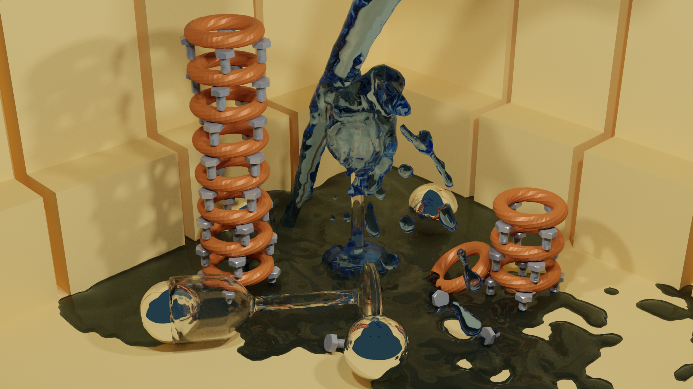

# PearRay  

\

Experimental high accurate spectral path and ray tracer.

:exclamation: **This is experimental software. API changes regularly. Don't use it for big projects (yet)** :exclamation:

## Blender Addon

There is an open source (still experimental) blender integration addon available [here](https://github.com/PearCoding/PearRay-Blender).

## Dependencies

- Boost <http://www.boost.org/>
- Eigen3 <http://eigen.tuxfamily.org>
- tinyobjloader <https://github.com/syoyo/tinyobjloader> (submodule)
- simdpp <https://github.com/p12tic/libsimdpp> (submodule)
- DataLisp <https://github.com/PearCoding/DataLisp> (submodule)
- OpenImageIO <https://sites.google.com/site/openimageio/home>
- Intel Threading Building Blocks <https://www.threadingbuildingblocks.org/>

### Optional

- OpenSubdiv <https://github.com/PixarAnimationStudios/OpenSubdiv>
- OSL <https://github.com/imageworks/OpenShadingLanguage>
- Qt <https://www.qt.io/>
- pybind11 <https://github.com/pybind/pybind11> (submodule)

## Wiki

See [Wiki](https://github.com/PearCoding/PearRay/wiki) for more information, examples and tutorials.
