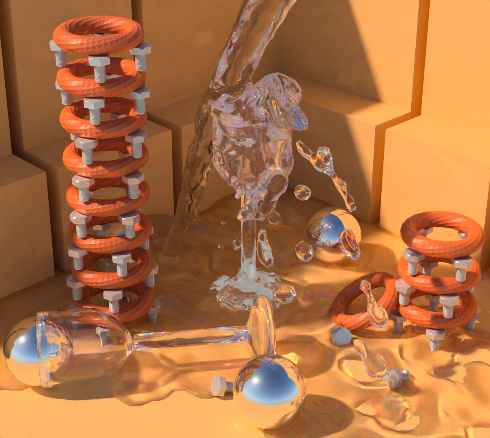

:exclamation: **This project is currently on hold in favour of my other renderer [Ignis](https://github.com/PearCoding/Ignis).** :exclamation:

# PearRay  

\

Experimental high accurate spectral path and ray tracer for research and data acquisition.

:exclamation: **This is experimental software. API changes regularly** :exclamation:

## Blender Addon

There is an open source (still experimental) blender integration addon available [here](https://github.com/PearCoding/PearRay-Blender).

## Dependencies

- Eigen3 <http://eigen.tuxfamily.org>
- OpenImageIO <https://sites.google.com/site/openimageio/home>
- Intel® Embree 3 <https://www.embree.org/>
- Intel® Threading Building Blocks <https://www.threadingbuildingblocks.org/>

### Optional

- OpenSubdiv <https://github.com/PixarAnimationStudios/OpenSubdiv>
- Qt <https://www.qt.io/>

### Submodules

- cxxopts <https://github.com/jarro2783/cxxopts>
- DataLisp <https://github.com/PearCoding/DataLisp>
- pybind11 <https://github.com/pybind/pybind11>
- tinyobjloader <https://github.com/syoyo/tinyobjloader>

### Embedded

- PCG Random Number Generation, C++ Edition <https://github.com/imneme/pcg-cpp>

### Other

- pugixml <https://github.com/zeux/pugixml> (daylight plugins)
- brdf-loader <https://github.com/rgl-epfl/brdf-loader> (rgl-epfl measured material plugin)

## Wiki

See [Wiki](https://github.com/PearCoding/PearRay/wiki) for more information, examples and tutorials.
